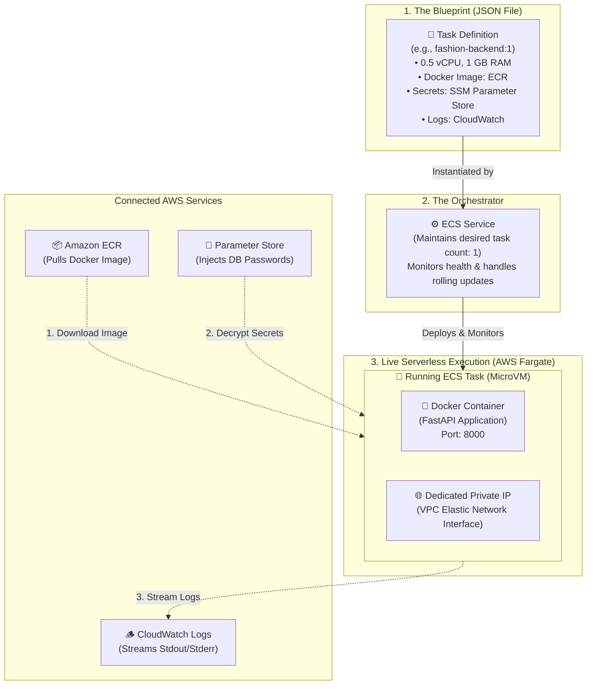

# 📦 Understanding Amazon ECS Task Definitions
### A Beginner-Friendly Visual Guide for Students & Developers

---

## 🎯 1. What is an ECS Task Definition? (The Core Concept)

Think of Amazon ECS (**Elastic Container Service**) using a simple everyday analogy:

| Concept | Real-World Analogy | Programming Analogy | AWS ECS Concept |
| :--- | :--- | :--- | :--- |
| **Blueprint / Recipe** | Architectural drawing of a house | `class User:` (The definition) | **Task Definition** (JSON blueprint) |
| **Physical Object** | The built physical house | `user1 = User()` (An active instance) | **Running Task** (Live container MicroVM) |
| **Supervisor** | Neighborhood building manager | Process Supervisor | **ECS Service** (Keeps tasks running) |

> 💡 **Summary:** An **ECS Task Definition** is a declarative **JSON configuration file** (a recipe) that tells AWS exactly **how to run your containerized application**. It does not run any code itself — it is the instruction manual AWS uses to launch tasks.

---

## 🖼️ 2. Visual Architecture: How Task Definitions Work



---

## 🔍 3. Anatomy of a Task Definition (Field-by-Field)

Here is the exact structure used in our **Maison Luxé Backend**:

```json
{
  "family": "fashion-backend",
  "networkMode": "awsvpc",
  "requiresCompatibilities": ["FARGATE"],
  "cpu": "512",
  "memory": "1024",
  "executionRoleArn": "arn:aws:iam::123456789012:role/ecsTaskExecutionRole",
  "containerDefinitions": [
    {
      "name": "fashion-backend",
      "image": "123456789012.dkr.ecr.ap-south-1.amazonaws.com/fashion-backend:latest",
      "essential": true,
      "portMappings": [
        { "containerPort": 8000, "protocol": "tcp" }
      ],
      "secrets": [
        { "name": "MYSQL_PASSWORD", "valueFrom": "/fashion-agent/MYSQL_PASSWORD" },
        { "name": "SENSENOVA_API_KEY", "valueFrom": "/fashion-agent/SENSENOVA_API_KEY" }
      ],
      "logConfiguration": {
        "logDriver": "awslogs",
        "options": {
          "awslogs-group": "/ecs/fashion-backend",
          "awslogs-region": "ap-south-1",
          "awslogs-stream-prefix": "backend"
        }
      }
    }
  ]
}
```

### The 6 Key Building Blocks:

### 1. `family`
* The friendly name of your task blueprint (e.g., `fashion-backend` or `fashion-frontend`).

### 2. `requiresCompatibilities: ["FARGATE"]`
* Tells AWS to run this serverless with **AWS Fargate** (no EC2 virtual machines to patch or maintain).

### 3. `cpu` and `memory`
* Hardware allocation for the task:
  * `cpu: "512"` = 0.5 vCPU
  * `memory: "1024"` = 1024 MB (1 GB) RAM

### 4. `executionRoleArn` (IAM Security)
* The AWS IAM role that gives **AWS ECS permission** before your container starts to:
  1. Authenticate with **Amazon ECR** and download the Docker image.
  2. Fetch and decrypt database passwords from **SSM Parameter Store**.
  3. Create streams and write logs into **AWS CloudWatch**.

### 5. `containerDefinitions`
* The container specifications inside the task:
  * **`image`**: Where to find the Docker image in Amazon ECR.
  * **`portMappings`**: Which port the app listens on inside the container (`80` for web, `8000` for FastAPI).
  * **`secrets`**: Injects secure environment variables directly from AWS Parameter Store into your container at startup without ever hardcoding passwords.
  * **`logConfiguration`**: Automatically redirects `print()` and error outputs into CloudWatch.

---

## 🔄 4. Versioning & Revisions (How CI/CD Works)

Task Definitions are **immutable** and **versioned**:

```
fashion-backend:1  (Initial placeholder)
       │
       ▼  (Developer pushes new code to GitHub)
fashion-backend:2  (New Docker image tag updated by GitHub Actions)
       │
       ▼  (Another release deployed)
fashion-backend:3  (Active production version)
```

1. Every time you update the JSON file or push code, ECS creates a **new Revision number** (`:1`, `:2`, `:3`...).
2. The **ECS Service** performs a **Zero-Downtime Rolling Update**:
   - It starts a new task with Revision 2.
   - It waits until the new task passes health checks (`/health` returns `200 OK`).
   - It routes traffic from the Load Balancer to the new task.
   - It gracefully terminates the old Revision 1 task.

---

## 🌟 Quick Summary for Students

| Question | Answer |
| :--- | :--- |
| **Where is it stored?** | Stored as a JSON file in your Git repo (`deploy/ecs-*.json`) and registered in AWS ECS. |
| **Does 1 Task Definition = 1 Container?** | Usually yes, but a single Task Definition can define multiple co-located containers (sidecars). |
| **How does it protect passwords?** | Via the `secrets` block, AWS pulls values directly from SSM Parameter Store into RAM at container boot. |
| **Who manages it?** | Your GitHub Actions CI/CD pipeline registers new revisions automatically upon every `git push`. |
